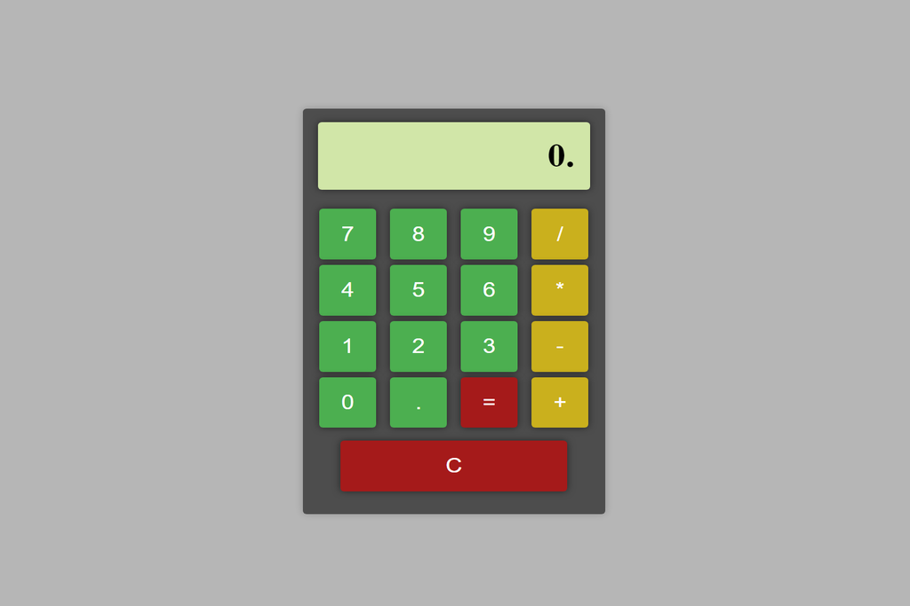

# React Calculator

This is a simple calculator application developed in React. With this application, users can perform basic mathematical operations such as addition, subtraction, multiplication, and division.

## Features

- Intuitive and easy-to-use user interface.
- Support for basic mathematical operations.
- Show the result of the operation in real-time.

## Prerequisites

Before starting to use this application, make sure you have the following installed on your system:

- [Node.js](https://nodejs.org/en/download/)
- [NPM](https://www.npmjs.com/get-npm)

## Installation

1. Download or clone this repository.
2. Open a terminal and navigate to the project directory.
3. Run the command `npm install` to install all necessary dependencies.
4. Once the dependencies have been installed, run the command `npm start` to start the application.
5. Open a browser and navigate to `http://localhost:3000` to see the application in action.

## Usage

The application is very easy to use. Simply click on the numerical buttons to input the numbers and then click on the operation buttons to perform the desired operation. The result of the operation will be displayed on the screen in real-time.

## Contributing

If you would like to contribute to this project, that would be great! You can do so in several ways:

- Report bugs and fix them.
- Add new features.
- Improve the documentation.

## Screenshot

  

## Test Project

> https://lucasbutto.github.io/Calculator/
